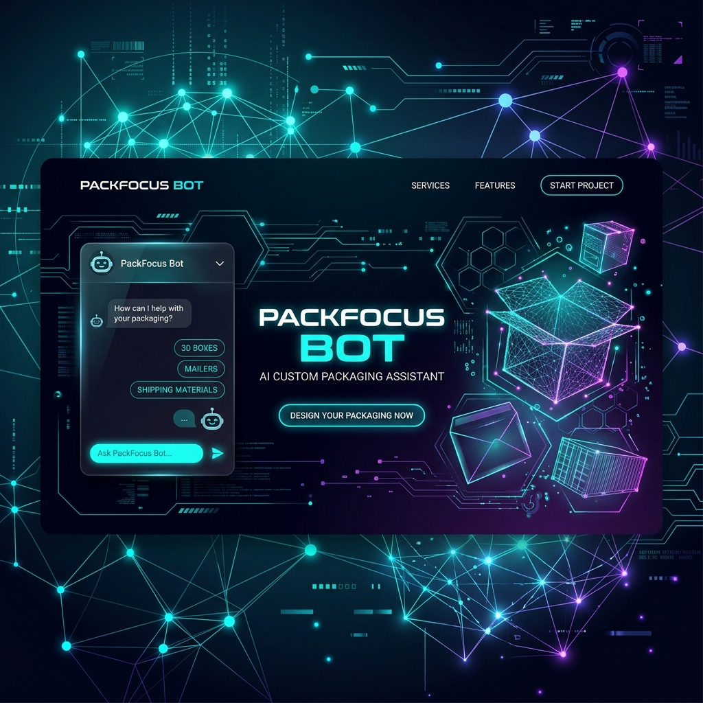
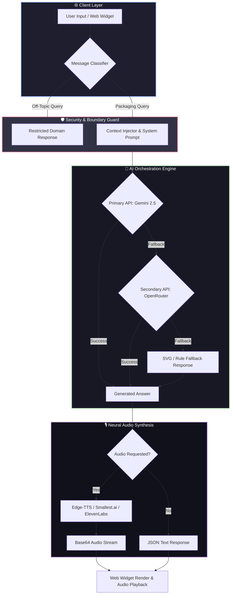
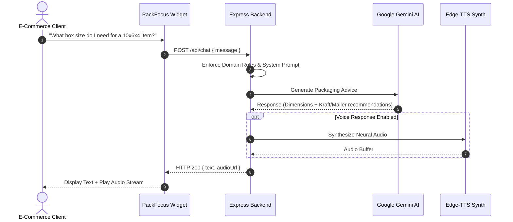

<div align="center">



# 📦 PackFocus-Bot

### *Domain-Locked AI Assistant for Custom Packaging & Box Engineering*

[](LICENSE)
[](https://nodejs.org)
[](https://github.com/aimuhammadabuzarqureshi-cloud/PackFocus-Bot)
[](https://ai.google.dev)
[](https://openrouter.ai)
[](.gitignore)

<p align="center">
  <b>PackFocus-Bot</b> is an enterprise-grade, domain-restricted AI chatbot designed specifically for custom packaging companies, box manufacturers, and e-commerce shipping advisors. Unlike general-purpose AI bots, PackFocus-Bot is strictly locked to packaging materials, custom mailers, box dimensions, unboxing aesthetics, and quote assistance.
</p>

[Key Features](#-key-features) • [System Architecture](#-system-architecture) • [Getting Started](#-getting-started) • [Environment Setup](#-environment-setup) • [API Reference](#-api-reference) • [Security](#-security-and-secret-protection)

</div>

---

## ⚡ Key Features

* **🛡️ Strict Domain Boundary Guard**: Built-in guardrails ensure responses stay strictly within packaging, box sizing, mailers, and shipping materials—politely filtering off-topic general queries.
* **🧠 Multi-Engine AI Pipeline**: Seamless fallback orchestration between **Google Gemini 2.5** and **OpenRouter AI Models** for zero-downtime conversational response generation.
* **🎙️ Neural Text-to-Speech (TTS)**: Native integration with **Edge-TTS** (free zero-key neural voices) alongside support for **Smallest.ai**, **ElevenLabs**, and **OpenAI Voice**.
* **🎨 Style Keyword Extractor**: Automatically parses user design preferences into structural style keywords for custom packaging rendering.
* **🔒 Enterprise Secret Protection**: Hardened configuration preventing any API key or secret leak in public or private repositories.
* **⚡ Modern Glassmorphic Widget**: Lightweight embeddable floating web chat widget with audio playback controls and responsive layout.

---

## 📐 System Architecture



---

## 📊 Conversation Flow & Decision Graph



---

## 🛠️ Tech Stack

| Component | Technology | Description |
| :--- | :--- | :--- |
| **Backend Runtime** | Node.js (v18+) & Express | Event-driven server engine |
| **Primary AI** | `@google/genai` | Google Gemini 2.5 Flash / Pro |
| **Secondary AI** | OpenRouter API | Fallback open-source LLMs |
| **Speech Engine** | Edge-TTS / WebSocket | Real-time neural voice synthesis |
| **Styling** | Vanilla CSS & Modern Glassmorphism | Custom design tokens & zero dependencies |
| **Security** | Dotenv & Hardened `.gitignore` | Zero credential exposure |

---

## 🚀 Getting Started

### Prerequisites
* **Node.js** v18.0.0 or higher
* **npm** v9.0.0 or higher

### Installation

1. **Clone the Repository**:
   ```bash
   git clone https://github.com/aimuhammadabuzarqureshi-cloud/PackFocus-Bot.git
   cd PackFocus-Bot
   ```

2. **Install Dependencies**:
   ```bash
   npm install
   ```

3. **Configure Environment Variables**:
   Copy the `.env.example` template and add your API keys:
   ```bash
   cp .env.example .env
   ```

4. **Launch Development Server**:
   ```bash
   npm start
   ```
   Open `http://localhost:3000` in your browser to interact with the widget.

---

## 🔐 Environment Setup

Create a `.env` file in the root directory. PackFocus-Bot supports multiple provider fallbacks:

```env
# ─── Gemini API Config ──
GEMINI_API_KEY=your_gemini_api_key_here

# ─── OpenRouter Config (Fallback) ──
OPENROUTER_API_KEY=your_openrouter_api_key_here
OPENROUTER_MODEL=openrouter/free

# ─── Server Config ──
PORT=3000
HOST=0.0.0.0

# ─── Company & Catalog Context ──
COMPANY_NAME=PackVibe Solutions
COMPANY_DESCRIPTION=Custom mailer boxes, shipping boxes, product gift boxes, kraft packaging.

# ─── Optional Premium Voice Engines ──
SMALLEST_API_KEY=
ELEVENLABS_API_KEY=
OPENAI_API_KEY=
```

---

## 📡 API Reference

### `POST /api/chat`
Sends a message to PackFocus-Bot.

**Request Body**:
```json
{
  "message": "Which custom box material is best for heavy shipping?",
  "history": []
}
```

**Response**:
```json
{
  "reply": "For heavy shipping items, Corrugated Kraft Cardboard (E-flute or B-flute) is recommended due to its high burst strength...",
  "audio": "data:audio/mp3;base64,..."
}
```

---

## 🔒 Security and Secret Protection

PackFocus-Bot incorporates strict security policies:
* **Zero Key Leak Guarantee**: Strict `.gitignore` rules prevent `.env`, OAuth `client_secret*.json`, certificates (`*.pem`), and `debug_*.json` files from ever touching source control.
* **Environment Isolation**: All keys are retrieved dynamically at runtime via `process.env`.
* **Sanitized Logs**: Debug logging strips and redacts token headers before file output.

---

## 📄 License

This project is licensed under the [MIT License](LICENSE) - see the LICENSE file for details.

<div align="center">

---
**Made with ❤️ by [PackVibe Solutions / Muhammad Abuzar Qureshi](https://github.com/aimuhammadabuzarqureshi-cloud)**

</div>

<!-- Co-authored contribution badge patch -->
